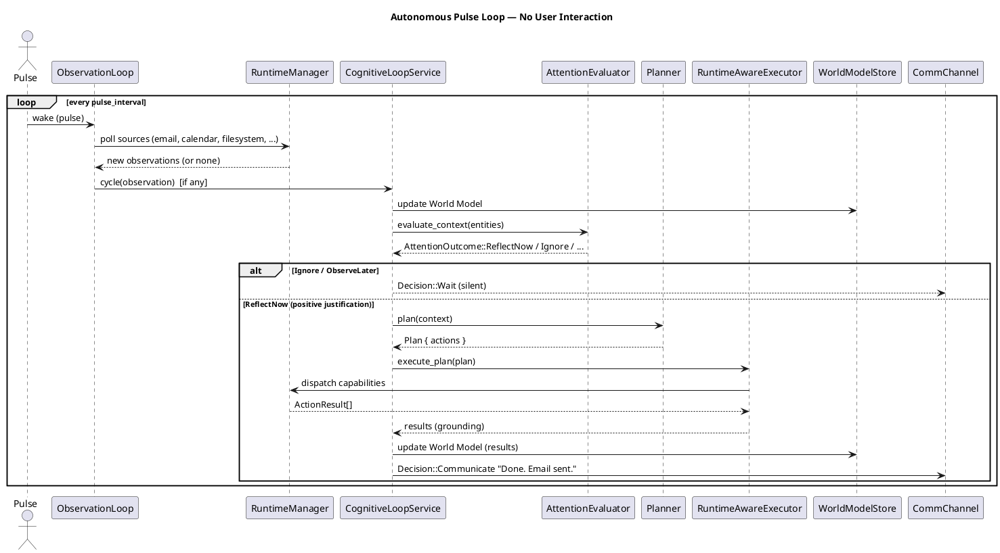
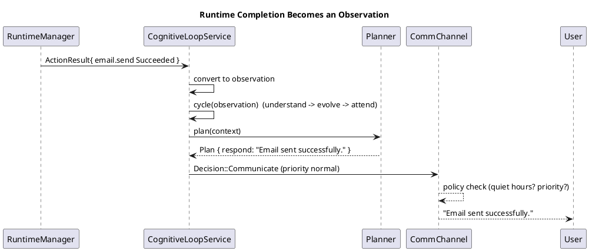
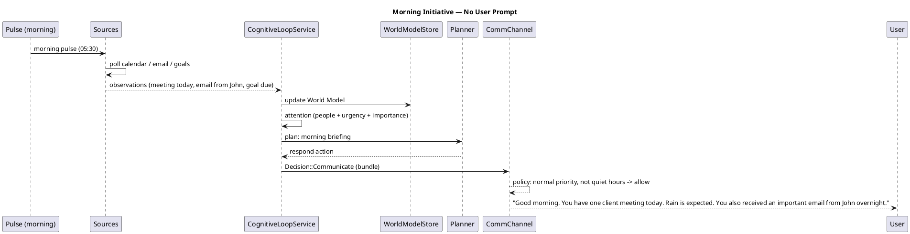
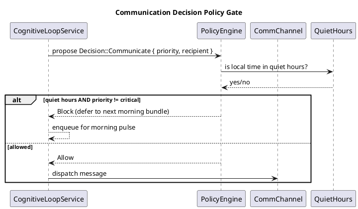

# Autonomous Companion Architecture

**Status:** Accepted (orchestration design)
**Date:** 2026-08-08
**Scope:** Restores LIFE's original vision — a persistent, event-driven companion, not a chatbot.
**Constraint:** No redesign of Brain, Planner, Runtime, Providers, OpenClaw, Memory, World Model, Goals, Learning, or Recovery. Missing behavior emerges from **orchestration** of the architecture that already exists.

---

## 1. Vision

### 1.1 What LIFE Is NOT

```
User ──▶ Message ──▶ AI ──▶ Reply
```

A linear request/response chatbot that only wakes when the user sends a message.

### 1.2 What LIFE IS

```
World ──▶ Observations ──▶ World Model ──▶ Continuous Cognition ──▶ Decision ──▶ Action ──▶ Communication
  ▲                                                                                        │
  └────────────────────────────── observe result ◀─────────────────────────────────────────┘
```

The user is **one source of observations**, not the trigger of cognition. The world is continuously changing even when the user is silent. LIFE thinks continuously.

### 1.3 Guiding Principle

> The user should never have to "wake up" LIFE with a message. LIFE should already be awake — quietly watching, learning, remembering, thinking, and only speaking when it has something meaningful to contribute.

---

## 2. Current State Assessment

The runtime and intelligence machinery is complete and production-ready. The missing piece is **behavioral orchestration**: a continuous loop that treats every input as an observation and every world change as a potential trigger.

### 2.1 What Already Exists

| Capability | Location | State |
|---|---|---|
| Cognitive pipeline (understand → memory → evolve → plan → execute → decide) | `brain/brain-coordinator/src/cognitive_loop.rs` (`CognitiveLoopService`) | ✅ Works |
| Self-initiated reflection with positive-justification gating | `cognitive_loop.rs::tick()` + `decide_on_context()` | ✅ Works (not scheduled in production) |
| Attention evaluation with 8 signals + fatigue/rhythm | `brain/brain-coordinator/src/attention.rs` (`AttentionEvaluator`, `AttentionMemory`, `Rhythm`, `AttentionOutcome`) | ✅ Works |
| Observation loop (poll + change-detect + dedup) | `companion_host/observation_loop.rs` + `companion_host/sources/*` | ✅ Works (3 sources) |
| World Model (entity graph, persistence, evolution) | `brain-coordinator/src/world_model.rs`, `crates/memory-*` | ✅ Works |
| Runtime capability dispatch with grounded results | `planner/runtime_executor.rs` (`RuntimeAwareExecutor`, `format_runtime_results`) | ✅ Works |
| Telegram channel | `companion_host/telegram.rs` (`TelegramAdapter`) | ✅ Works |
| Goals, reflection, learning, recovery | `brain-goals`, `brain-reflection`, `brain-learning`, `brain-coordinator/src/recovery.rs` | ✅ Works (manual/test-driven) |
| Event-driven goal layer | `brain-coordinator/src/event_driver.rs`, `goal_scheduler.rs`, `event_replay.rs` | ⚠️ Partially wired |
| Capability policy (risk/confirmation) | `crates/capability-policy` | ✅ Works |

### 2.2 The Gap

The platform **can** do everything the vision requires, but today it only runs when triggered:

- `CompanionHost::start()` spawns the observation loop, a cognitive worker, auto-save, and Telegram polling — but **no periodic self-reflection tick** is scheduled (`reflection_frequency_secs` is read from settings but unused; `tick()` only runs in tests/simulation).
- The observation loop only polls `time`, `system`, and optionally `desktop`. Runtime completions, incoming Gmail/WhatsApp/Calendar, goals, and learning are **not observation sources**.
- The cognitive worker is a **push loop**: it waits on `cognitive_rx.recv()`. With no sources producing events and no tick schedule, it sleeps forever in silence.
- Runtime `ActionResult` is used to **ground the reply** but is not converted back into an **observation** for the next cycle.
- The goal-driven `BrainOrchestrator`/`EventDriver` stack and the companion `CognitiveLoopService` are two engines that never call each other.
- The decision is only `Communicate` or `Wait` in practice; `Execute`/`UpdateMemory` are never emitted by the production loop.

### 2.3 What This Document Adds

An orchestration layer that makes the existing machinery **self-driving**:

1. A **pulse loop** that runs the cognitive cycle on a schedule even with zero user input.
2. A **source registry** that converts Gmail, WhatsApp, Telegram, Calendar, Filesystem, Goals, Runtime events, Time, Learning, and Reflection into observations.
3. An **initiative engine** (built on the existing `AttentionEvaluator`) that decides *whether, when, and how loudly* to speak.
4. **Communication policy** — quiet hours, notification priority, concise phrasing — implemented as policy rules, not hardcoded templates.
5. **Runtime completion events** — every dispatched action result becomes an observation.

---

## 3. The Continuous Cognitive Loop

The single loop that drives everything. It runs forever, independent of user messages.

```
┌─────────────────────────────────────────────────────────────────────┐
│                        AUTONOMOUS PULSE LOOP                        │
│                                                                     │
│  loop {                                                             │
│    1. Collect observations        ← sources polled + events pushed  │
│    2. Update World Model          ← understanding + evolution       │
│    3. Think                       ← attention + context eval        │
│    4. Should I act?               ← initiative decision             │
│       │  No  → Sleep (until next beat or an event arrives)          │
│       ▼  Yes                                                       │
│    5. Plan                        ← planner over current context    │
│    6. Execute actions             ← runtime / in-memory executor    │
│    7. Observe result              ← ActionResult → new observation  │
│    8. Update World Model          ← learning + reflection inputs    │
│  }                                                                  │
└─────────────────────────────────────────────────────────────────────┘
```

### 3.1 Mapping to Existing Code

| Loop phase | Existing implementation | Orchestration change |
|---|---|---|
| Collect observations | `ObservationSource::poll()` + `ObservationLoop` + `TelegramAdapter` | Register new sources (see §4); emit `ActionResult` observations |
| Update World Model | `CognitiveLoopService::cycle()` (Understanding → MemoryEvaluator → Evolution) | — (already the pipeline) |
| Think | `AttentionEvaluator::evaluate()` / `evaluate_context()` | Run `tick()` on the pulse schedule |
| Should I act? | `decide_on_context()` + `AttentionOutcome` | Drive from pulse, not only from user input |
| Plan | `Planner` | — |
| Execute | `ActionExecutor` + `RuntimeAwareExecutor` | — |
| Observe result | `format_runtime_results` | Also publish result as an observation (§7) |
| Learn / reflect | `Reflector`, `LearningEngine` | Trigger on goal completion and on night rhythm (§9) |

### 3.2 Two Wake Mechanisms

The loop wakes in exactly two ways:

1. **Event wake (priority)** — a source pushes an observation (incoming message, email, runtime completion, filesystem change, goal event). These go straight into the cognitive channel.
2. **Pulse wake (background)** — the `pulse_interval` timer fires (default 60s), running `tick()`: attention evaluated against World Model state alone, with positive-justification gating.

This guarantees continuous cognition with zero user interaction while staying efficient (no busy-loop).

---

## 4. Observation Lifecycle

### 4.1 The `ObservationSource` Contract

Everything in LIFE's world becomes an observation. The existing contract is reused verbatim:

```rust
#[async_trait]
pub trait ObservationSource: Debug + Send + Sync {
    fn name(&self) -> &'static str;
    async fn poll(&self) -> Option<String>;   // None = nothing meaningful
}
```

Polled sources are registered with the `ObservationLoop` (which applies the `ChangeDetector` dedup). Push sources (Telegram, runtime completions) write directly to the cognitive channel.

### 4.2 Observation → World Model Flow

```
 source.poll() ──▶ String observation ──▶ change-detected? ──No──▶ dropped (silence)
                                    │ Yes
                                    ▼
                       CognitiveLoopService::cycle(observation)
                                    │
      ┌─────────────────────────────┼──────────────────────────────┐
      ▼                             ▼                              ▼
World Understanding           Memory Evaluator              (Attention)
(LLM → StructuredWorldUpdate) (what's worth keeping)        (should we act now?)
      │                             │                              │
      ▼                             ▼                              │
Evolution Engine ───────────▶ World Model store                    │
 (entities, relationships, confidence, importance)                 │
      └────────────────────────────────────────────────────────────┘
                                    ▼
                              Planner / Execute / Decide
```

### 4.3 Source Registry

| Source | Kind | Produces | Notes |
|---|---|---|---|
| `time` | polled | hour-bucket changes ("day N, morning") | already wired |
| `system` | polled | system state summaries | already wired |
| `desktop` | polled | desktop events | optional provider |
| `telegram` | pushed | inbound messages | already wired |
| `email` (Gmail) | polled | new/unread important mail | new source via runtime `email` capability |
| `whatsapp` | polled | new inbound messages | new source via runtime `whatsapp` capability |
| `calendar` | polled | upcoming/imminent events | new source via runtime `calendar` capability |
| `filesystem` | event/polled | watched-dir changes, build results | new source via runtime `filesystem` capability |
| `github` | polled | new issues/assignments | new source via runtime `github` capability |
| `goals` | event | goal created/updated/stagnated | reuse `EventDriver` + `GoalScheduler` |
| `runtime` | event | capability status_changed, dispatch results | **§7** |
| `reflection` | pulse | scheduled reflection trigger | pulse loop |
| `learning` | event | lesson/pattern insights | after reflection/goal completion |

**Orchestration rule:** sources live in `companion_host/sources/`. A source wraps a runtime capability via a thin `poll()` that asks the `RuntimeManager` for "what's new since last poll" and returns text. This is exactly the pattern already used by `RuntimeObservationSource` in `tests/cognitive-integration/src/source.rs` — promoted into the production host.

---

## 5. Initiative Decision Engine

Built entirely on the existing `AttentionEvaluator`. The engine answers: *"Is this worth interrupting the user?"*

### 5.1 Signals (already implemented)

| Signal | Source | Meaning |
|---|---|---|
| `people` | entities of type person/user/human | someone important involved |
| `urgency` | urgent language / blocked / failing / overdue | time-sensitive |
| `novelty` | new observations, hypotheses, open questions | new information |
| `uncertainty` | low confidence, big confidence deltas | unclear |
| `state_change` | attribute/value transitions | things changed |
| `relationship` | new/strengthened relationships | relationships shifted |
| `importance` | entity importance ≥ 0.8 | important matters |
| `anomaly` | possible hypotheses | unusual pattern |
| `stagnation` *(context)* | important entity untouched > 1 day | neglected topics |

Each signal is evaluated independently (no fixed weights). The dominant signal + combined strength drive an `AttentionOutcome`.

### 5.2 Outcome → Decision Mapping

| `AttentionOutcome` | Produces | Action |
|---|---|---|
| `Ignore` | `Decision::Wait` | store observation, stay silent |
| `ObserveLater { rhythm }` | `Decision::Wait` + re-evaluation timer | silently reschedule attention |
| `ReflectSoon { rhythm }` | `Decision::Wait` + timer | deeper reflection later |
| `ReflectNow` | `decide_on_context()` → `Decision::Communicate` | check World Model for a positive justification |
| `AskUser { question }` | `Decision::Communicate` | needs input to proceed |
| `Suggest { message }` / `Notify { message }` | `Decision::Communicate` | proactive outreach |
| `Escalate { reason }` | `Decision::Communicate` (urgent) | human attention needed |

### 5.3 Positive-Justification Gating

`decide_on_context()` already enforces the critical anti-noise rule: **context alone is not enough**. LIFE communicates during a self-initiated tick only when there is positive justification:

- stagnation of an important entity (`stagnation > 0.15`), or
- a high-importance follow-up after a quiet period (`importance > 0.8`, `silent_ticks >= 3`).

This is preserved unchanged. The initiative engine adds the pulse schedule so these checks actually run.

---

## 6. Communication Policy

### 6.1 Policy-Driven, Not Hardcoded

`brain-policy` provides the `PolicyEngine`/`PolicyStore` traits (rule sets, conditions, actions). Communication behavior is expressed as policy rules, evaluated before any `Decision::Communicate` is dispatched:

```
RuleSet: communication.policy
  - IF recipient == user AND local_time IN quiet_hours
      THEN action = Block (defer to next morning bundle)
  - IF notification.priority == critical
      THEN action = Allow (interrupt immediately)
  - IF notification.priority == normal AND local_time IN quiet_hours
      THEN action = Defer (bundle)
```

The `PolicyEvaluator` is injected into the cognitive worker so every communication decision passes through it. No new architecture — the existing trait layer is given concrete rules.

### 6.2 Notification Priority

Every communication candidate carries a priority, derived from attention signals:

| Priority | Signal threshold | Behavior |
|---|---|---|
| `Low` | below attention threshold | not communicated (stored only) |
| `Normal` | threshold met | communicate now, unless quiet hours |
| `High` | combined ≥ 0.8 or urgency/people/state_change | communicate now |
| `Critical` | urgency ≥ 0.9 or escalation | interrupt immediately (quiet hours bypass) |

### 6.3 Concise Phrasing

The conversation layer must stop exposing implementation steps.

| ❌ Implementation | ✅ Outcome |
|---|---|
| "I'm checking…" / "I'll verify…" | (silent execution) |
| "Planning…" / "Dispatching…" / "Waiting…" | (never spoken) |
| "I'll see…" / "Let me check" | "I'll send it." |
| — | "Done. Email sent." |
| "Let me check your inbox" | "I found three important emails." |

**Rule:** acknowledgement (≤ 1 sentence) when an action starts; a single completion message when it finishes. Implementation steps belong in logs (`tracing`), never in conversation.

---

## 7. Runtime Completion Events

Completion must be **proactive**, not polled by the user.

### 7.1 Current Behavior

```
User: "Send email"  →  planner  →  runtime  →  reply "Done"     (reply is grounded ✓)
User: "Done?"       →  assistant checks  →  reply                 (user must ask ✗)
```

### 7.2 Required Behavior

```
email.send ──▶ ActionResult{ Succeeded } ──▶ Observation ──▶ Planner ──▶ Communicate ──▶ "Email sent successfully."
```

### 7.3 Orchestration

The `RuntimeAwareExecutor` currently returns `(action_type, ActionResult)` pairs into the loop for grounding. The orchestration adds one step: **each result is converted to an observation and pushed back into the cognitive channel**.

```
ActionResult ──▶ observation text:
  "Runtime action 'email.send' SUCCEEDED (sent to x@y, subject 'Z')."
  "Runtime action 'telegram.send' FAILED (code: capability_not_found, ...)."

observation ──▶ cycle() ──▶ planner ──▶ Decision::Communicate (if worth interrupting)
```

A `RuntimeCompletionSource` (or direct push from the executor) converts dispatch results into observations. The next cycle decides whether the completion warrants communication — with a policy bias toward reporting `Succeeded` actions that the user asked for, and `Failed`/`ConfigurationMissing` actions that need attention.

---

## 8. Quiet Hours & Attention Management

### 8.1 Quiet Hours

Defined in settings (`CompanionSettings`) and enforced by the communication policy:

```toml
[communication.quiet_hours]
enabled = true
start = "22:00"   # defer non-critical communications
end = "08:00"
timezone = "local"
```

- **Normal/High** communications are deferred to the next morning bundle.
- **Critical** (escalation, urgency ≥ 0.9) still interrupt.
- The existing negative attention on `state == sleeping|asleep` is preserved (no interruption when the user is asleep).

### 8.2 Attention Management

`AttentionMemory` already adapts the interruption threshold from history:

- **Ignores/rejects/fatigue** → threshold rises (LIFE gets quieter).
- **Accepts** → threshold falls (LIFE speaks more).
- **Consecutive ignores** accumulate; fatigue decays.

This adaptive behavior is kept and now actually exercises over time because the pulse loop generates attention decisions continuously.

---

## 9. Daily Rhythm & Autonomous Scheduling

### 9.1 Rhythm as a Scheduling Primitive

The `Rhythm` enum already exists: `Immediate | Minutes(n) | Morning | Evening | Weekly | Monthly | LongTerm`. Today only `Minutes(n)` is emitted. Orchestration schedules **all** rhythms:

| Rhythm | Scheduled trigger |
|---|---|
| `Minutes(n)` | pulse wake after n minutes |
| `Morning` | next 05:00–08:00 pulse |
| `Evening` | next 17:00–21:00 pulse |
| `Weekly` / `Monthly` | recurring pulse |
| `LongTerm` | low-priority re-evaluation |

A **rhythm scheduler** maps deferred `AttentionOutcome` rhythms to future wake times and enqueues them into the pulse loop.

### 9.2 Daily Rhythm

| Window | Activities | Output |
|---|---|---|
| **Morning** (05–08) | greeting, today's agenda, overnight events, suggestions | bundled message |
| **Afternoon** (12–16) | only meaningful updates | sparse |
| **Evening** (17–21) | reflection, completed goals, tomorrow's priorities | bundled message |
| **Night** (22–05) | learning, memory consolidation, planning | internal (silent) |

Each window is a scheduled pulse that runs `tick()` against the World Model with the appropriate focus. No user interaction required.

### 9.3 Example Initiative Flows

```
Morning
  calendar says: client meeting 10:00
  weather: rain
  unread important email from John (overnight)
  goal due today
  ──▶ bundled: "Good morning. You have one client meeting today. Rain is
       expected. You also received an important email from John overnight."

Filesystem
  build completed successfully
  ──▶ observation ──▶ planner ──▶ "The deployment completed successfully."

GitHub
  new issue assigned to you
  ──▶ observation ──▶ planner ──▶ "A new bug was assigned to you."

Inactivity
  user quiet several days; Project Alpha goal unfinished
  ──▶ reflection ──▶ "You planned to finish Project Alpha this week.
       Would you like to continue today?"
```

### 9.4 Internal Thoughts

Most thoughts produce no communication. On every pulse the loop asks silently:

- Should I remind Siva?
- Has anything important happened?
- Has a goal stalled?
- Has a deadline changed?
- Is somebody waiting?
- Should I summarize today?
- Should I reorganize priorities?
- Should I learn from today's failures?

These run `tick()`, update memory/reflection logs, and almost always return `Decision::Wait`. Communication is the exception, not the rule.

---

## 10. Behavior State Machine

The companion as a whole is a state machine. States are derived from the existing `AttentionOutcome` + `Decision` vocabulary.

```
                        event / pulse
                     ┌─────────────────────────┐
                     ▼                         │
              ┌───────────┐     no positive    │
   ──▶       │  OBSERVING │──── justification ─┤
             └───────────┘                     │
                │  ▲                           │
   wake        │  │                            │
   │           │  └──────┐                    │
   ▼           ▼         │                    │
┌────────┐  ┌───────────┐│  ┌──────────────┐  │
│ SLEEP  │◀─│ THINKING  ││  │   ACTING     │  │
└────────┘  └───────────┘│  └──────────────┘  │
      ▲        │         │        │           │
      │   positive       │   plan actions     │
      │   justification  │   (runtime/in-     │
      │        ▼         │    memory)         │
      │   ┌───────────┐  │        │           │
      │   │SPEAKING   │──┘        ▼           │
      │   └───────────┘     ┌───────────┐     │
      │   Communicate       │ LEARNING /│     │
      └────────────────────│REFLECTION │─────┘
            (message sent)  └───────────┘
                             (result → observation)
```

### 10.1 States & Transitions

| State | Meaning | Entry | Exit |
|---|---|---|---|
| `SLEEP` | no pending work; waiting for next pulse/event | after a cycle with `Decision::Wait` | wake (event or pulse) |
| `OBSERVING` | collecting source observations | any wake | observations collected → `THINKING` |
| `THINKING` | attention + context evaluation | observations/World Model state ready | negative → `SLEEP`; positive → `SPEAKING` or `ACTING` |
| `SPEAKING` | communicating a decision | `Decision::Communicate` | message dispatched → `SLEEP` (via learning) |
| `ACTING` | executing a plan (runtime/in-memory) | plan produced | actions complete → `LEARNING/REFLECTION` → observation → `OBSERVING`/`SLEEP` |
| `LEARNING/REFLECTION` | consolidation, lesson extraction | goal completion, action result, night rhythm | world model updated → `OBSERVING`/`SLEEP` |

Transitions are validated by the same discipline as existing state machines (e.g., Runtime `RuntimePhase`): every transition is explicit, invalid transitions are rejected, and every transition is observable (logged + audited).

---

## 11. PlantUML Sequence Diagrams

### 11.1 Autonomous Pulse (Zero User Input)



### 11.2 Runtime Completion → Proactive Notification



### 11.3 Morning Initiative (World-Model-Driven)



### 11.4 Communication Policy Gate



---

## 12. Orchestration Wiring Summary

The following production wiring makes the architecture self-driving. All targets already exist; the change is connecting them.

| # | Wiring | Target file |
|---|---|---|
| 1 | Schedule a periodic `tick()` pulse (honor `reflection_frequency_secs`; default 60s) | `companion_host/mod.rs::start()` |
| 2 | Register runtime-backed observation sources (email, whatsapp, calendar, filesystem, github) | `companion_host/sources/` + `main.rs` |
| 3 | Convert `ActionResult` → observation and push back into the cognitive channel | `planner/runtime_executor.rs` / cognitive worker |
| 4 | Inject `brain-policy` `PolicyEngine` into the cognitive worker; author `communication.policy` ruleset | `companion_host/mod.rs` + policy crate |
| 5 | Add quiet-hours + notification-priority settings to `CompanionSettings`; enforce via policy | `companion_host/settings.rs` |
| 6 | Schedule `Rhythm` outcomes (Morning/Evening/Weekly/Monthly) into the pulse loop | `companion_host` rhythm scheduler |
| 7 | Trigger `Reflector` + `LearningEngine` on goal completion and on the night pulse | `brain-coordinator` (reuse `BrainOrchestrator::reflect_on_workflow` / `learn_from_reflection`) |
| 8 | Unify the goal event stack (`EventDriver`, `GoalScheduler`) with the companion channel so goal events become observations | `brain-coordinator` runtime wiring |
| 9 | Run the companion as a daemon (no countdown) | `apps/desktop-companion/src/main.rs` |

---

## 13. Acceptance Criteria

| # | Criterion | Mechanism |
|---|---|---|
| 1 | Continues thinking without user messages | pulse loop + `tick()` scheduled |
| 2 | External events become observations | source registry (email/whatsapp/calendar/filesystem/github) |
| 3 | Runtime completion automatically informs the user | `ActionResult` → observation → planner → Communicate |
| 4 | Good morning messages generated from World Model | morning pulse + attention + planner |
| 5 | Important emails proactively surfaced | email source + `people`/`urgency`/`importance` signals |
| 6 | Calendar changes trigger notifications | calendar source + state-change signal |
| 7 | Goal stagnation detected | stagnation signal + `GoalScheduler` review |
| 8 | Reflection happens automatically | pulse + `Reflector` on goal completion / night |
| 9 | Communication is concise and natural | communication policy (no implementation steps) |
| 10 | Internal reasoning is hidden | policy: only outcomes spoken; logs carry the rest |
| 11 | User never asks "Did it finish?" | runtime completion observations |
| 12 | Telegram becomes one channel, not the only trigger | push sources + pulse replace Telegram-only wake |
| 13 | LIFE behaves as a persistent companion | daemonized host + continuous loop |

---

## 14. Non-Goals

- No new providers, tools, or plugins.
- No changes to the cognitive pipeline, planner, runtime, memory, or world model internals.
- No redesign of `brain-policy`; concrete rulesets are authored against the existing trait layer.
- `UpdateMemory` and `Execute` decision variants remain available but are not forced; behavior emerges from orchestration.

---

## 15. References

- [Project Vision](../vision.md) — "The system should feel less like a tool that awaits commands and more like an intelligent companion that shares the user's journey."
- [Cognitive Loop](../cognitive-loop.md) — the pipeline and attention/rhythm system.
- [Communication Philosophy](../communication-philosophy.md) — phrasing rules.
- [Cognitive Layer](./cognitive-layer.md) — runtime-aware execution and observation sources.
- [World Model](./world-model.md) — the entity graph that grounds all cognition.
- [Planner](./planner.md) — action planning.
- [Executor](./executor.md) — action execution.
- [Reflection](./reflection.md) — reflection and learning lifecycle.
