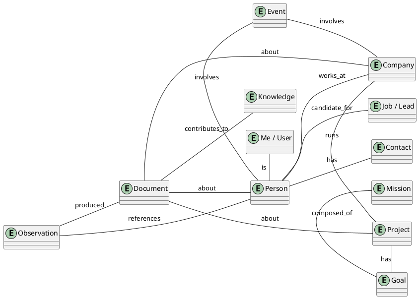

# LIFE World Store — Persistence & Data Foundation Audit

> **Status:** Draft v0.1 (audit + design, read-only)
> **Scope:** Where LIFE's persistent world data should live; what exists today;
> what becomes the canonical World Store; what must change.
> **Audit date:** 2026-08-08
> **Related:** `life-os-system-spec.md`, `life-os-package-manifest.md`,
> `life-world-store-schema.md` (schema only).

This is an **audit/design deliverable**. Nothing was changed, migrated, or deleted.
No database was created. No AI-OS code was rewritten.

## 1. Existing persistence inventory

### 1.1 Complete inventory

The workspace (`/home/arch/ai-os`, 89 crates) has exactly **8 disk-persisted artifacts**
and **zero databases** (no SQLite, RocksDB, sled, redb, surrealdb, postgres anywhere —
verified across all `Cargo.toml` and sources).

| # | Store | Code location | On-disk location | Format | Persists across restart |
|---|---|---|---|---|---|
| 1 | **World Model** | `brain/.../companion_host/persistence.rs` | `~/.local/share/ai-os-companion/world_model.json` | Pretty JSON `{entities, relationships, saved_at}` | Yes |
| 2 | **Companion settings** | `brain/.../companion_host/settings.rs` | `~/.config/ai-os-companion/settings.json` | Pretty JSON `CompanionSettings` | Yes |
| 3 | **Audit log** | `brain/.../companion_host/audit_log.rs` | `~/.local/share/ai-os-companion/audit_log.json` | Pretty JSON ring buffer (1000) | Yes (shutdown only) |
| 4 | **Telegram identities** | `brain/.../companion_host/telegram.rs` | `~/.local/share/ai-os-companion/telegram_identities.json` | Pretty JSON array | Yes (write-through) |
| 5 | **Encryption key** | `brain/.../companion_host/privacy.rs` | `~/.config/ai-os-companion/.encryption_key` | Raw 32-byte AES-256 key | Yes |
| 6 | **Backups** | `brain/.../companion_host/privacy.rs` | `~/.local/share/ai-os-companion/backups/*.bak` | `fs::copy` of target | Yes |
| 7 | **Provider credentials** | `tools/life/src/setup/env_file.rs` | `runtime/config/.env` (workspace) | `KEY=VALUE`, mode 0600 | Yes |
| 8 | **Autostart entry** | `apps/desktop-companion/src/autostart.rs` | `~/.config/autostart/ai-os-companion.desktop` | `.desktop` text | Yes |

### 1.2 Everything else is in-memory

The entire memory platform is volatile `RwLock<HashMap>`/`RwLock<BTreeMap>` state with
**no fs imports** in the crates:

| Store | Trait / impl | Durable? |
|---|---|---|
| `MemoryStore` | `store.rs`; impls `InMemoryStore`, `MockStore`, `DefaultMemoryStore`(errors) | No |
| `StorageBackend` | `backend.rs`; only `DefaultStorageBackend` (errors) — SQLite/RocksDB are documented future | No |
| `WorldModelStore` | `wm_store.rs`; only `InMemoryWorldModelStore` | No (only via companion JSON dump) |
| `Transaction` / `BatchOperation` | `transaction.rs` / `batch.rs`; only error-returning defaults | No |
| Indexes (`TimeIndex`, `RelationshipIndex`, `MetadataIndex`, `TagIndex`) | `memory-index`; only no-op defaults | No |
| Episodic memory / timeline | `memory-episodic` | No |
| Semantic memory / concepts / facts | `memory-semantic` | No |
| Knowledge base / graph | `memory-knowledge` | No |
| Working memory / scratchpad / context | `memory-working`, `memory-context` | No (context snapshot returns bytes, never written) |
| Cache (memory + intelligence + execution) | `memory-cache`, `intelligence-cache`, `execution-resolution` | No |
| **Goals** (`GoalStore`, snapshots) | `brain-goals/src/memory_store.rs` | **No — goals are lost on restart** (snapshots live in an in-memory map) |
| **Lessons / learning state** | `brain-reflection/lesson_store.rs`, `brain-learning` | **No** |
| `EventJournal` / replay | `brain-coordinator/src/event_replay.rs` | No (in-memory, despite "persistence" doc) |
| Observation history | `companion_host/observation_loop.rs` | No (ring buffer, max 100) |
| LLM response cache, telemetry, health, approval | various | No |
| Conversation history | `brain-model/src/context.rs` | No |
| Core config (`LayeredConfigProvider` etc.) | `core/src/config/` | In-memory only |
| **`platform.toml`** | workspace root | **Never read by any Rust code** (grep: zero references) |

### 1.3 Read/write APIs (current)

- **World Model** — `WorldModelStore` (18 methods): `insert_entity/get_entity/
  update_entity/delete_entity/search_entities_by_type/search_entities_by_name/all_entities`,
  `all_relationships/insert_relationship/update_relationship/get_relationship/
  get_relationships_for_entity/get_relationships_between/get_neighbors/
  get_incoming_neighbors`, `entity_count/relationship_count/clear`.
  Durable wrapper: `PersistenceManager::load()` / `save(&[Entity], &[Relationship])`
  (atomic temp+rename; auto-save every 300 s; save on stop).
- **Settings** — `SettingsManager::load()/save()/get()/set()` (non-atomic write).
- **Audit log** — `AuditLog::record()/load()/save()/entries()`; saved only at shutdown.
- **MemoryStore** — `insert/update/delete/get/get_batch/query/count/stats/flush/compact`
  (no durable impl).

### 1.4 Lifecycle of the current World Model

```
CompanionHost::load → PersistenceManager::load → InMemoryWorldModelStore (populated)
        │                      ▲
        │  every 300s          │ on stop
        ▼                      │
store  ─────────────────►  world_model.json   (full-graph pretty JSON, atomic replace)
```

- Writes: AI (`EvolutionEngine` inside the cognitive loop) and user (UI
  `POST /api/forget|/api/correct|/api/merge` → `memory_control.rs`).
- User edits are **not flushed immediately** — next 5-min timer or shutdown.
- No WAL, no journal, no incremental persistence, no encryption of this file.

## 2. Existing World Model architecture

### 2.1 Schema (the single property-graph model)

```rust
Entity {
  id: EntityId,                  // UUID
  entity_type: String,           // OPEN string, no registry (high variance in practice)
  name: String,
  properties: HashMap<String, Value>,   // Value: String|Number|Boolean|Timestamp|EntityId|Array|Map|Null
  importance: f32,               // 0..1
  confidence: f32,               // 0..1
  created_at, updated_at: Timestamp,
  version: u64,
  lifecycle: EntityLifecycle,    // Active | Archived | Forgotten
  metadata: HashMap<String, String>,
}
Relationship {
  id: RelationshipId,
  relationship_type: String,
  source_id: EntityId, target_id: EntityId,
  properties: HashMap<String, Value>,
  confidence: f32, weight: f32,
  created_at, updated_at: Timestamp, version: u64,
}
```

- Implementation: `InMemoryWorldModelStore` (`wm_store.rs`) = 4 `RwLock<HashMap>` +
  outgoing/incoming adjacency indexes. `WorldModelChange`/`EntityDiff` are defined but
  never emitted.
- **No provenance field, no source reference, no observation link, no history retention.**
  `version` exists but there is no version history store; update overwrites in place.

### 2.2 Data flow (Observation → Understanding → Evolution → Storage → Retrieval)

`CognitiveLoopService::cycle(observation)` (`brain/brain-coordinator/src/cognitive_loop.rs`):

```
Observation (time/system/desktop/Telegram/Gmail/WhatsApp/runtime-result text)
   │
   ├─ 1. build_context()     Retrieve top-5 Active entities by score = importance*0.5
   │                           + recency*0.3 + confidence*0.2 → natural-language context
   ├─ 2. understand()        LLM → StructuredWorldUpdate { entities, relationships,
   │                           state_changes, new_observations, open_questions,
   │                           possible_hypotheses }
   ├─ 3. memory_evaluate()   LLM decides what to store
   ├─ 4. evolution.evolve()  Merge by name; merge_confidence/merge_importance;
   │                           insert/update entities & relationships (writes the store)
   ├─ 5. attention.evaluate()→ outcome (Ignore/ReflectSoon/…/Escalate)
   ├─ 6. planner.plan()      LLM plan over capabilities
   ├─ 7. executor.execute()  Rust actions (search_memory/respond/update_memory/…)
   │                           + RuntimeAwareExecutor → RuntimeManager → MCP
   └─ 8. Decision            (Wait | Communicate | UpdateMemory | Execute)
                              → CommunicationPolicy → notify/Telegram/UI/audit
```

- **Understanding** is LLM-driven (`WorldUnderstandingService`, `intelligence-coordinator/
  world_understanding.rs`), retries once on JSON parse failure.
- **Evolution** (`evolution.rs`): confidence merge `prev + 0.5*(obs-prev)`-style,
  importance merge; duplicates resolved by name. Produces `EvolutionReport`.
- **Storage**: only entities/relationships reach the durable store; `new_observations`,
  `state_changes`, `open_questions`, `possible_hypotheses` from the LLM update are **not
  persisted** (only used transiently).
- **Retrieval**: `search_entities_by_name/type`, `get_neighbors` (+ incoming),
  and the scoring in `build_context`. No full-text, no vector/embedding search
  (`intelligence-embeddings` returns empty).

### 2.3 Verdict on "can the World Model become the World Store foundation"

**Yes — the property-graph model is the right foundation and should be kept**, but the
*storage* around it is not yet a World Store. What is missing:

1. **Durable backend** behind `WorldModelStore` (today: full-graph JSON rewrite).
2. **Provenance & sources** (which observation/action/user caused each write).
3. **History/versioning** (today: in-place overwrite; `version` unused for history).
4. **Observation retention** (understandings are discarded after evolution).
5. **Typed entity catalogue** (today: free-form strings → variance like `email`, `email
   subject`, `email_body`, `Person`/`person`).
6. **Search** (full-text + filter + later vector).
7. **Concurrency control** (AI loop and user edits share one in-memory store today).

These are storage-layer additions, **not** model redesigns. The `Entity`/`Relationship`/
`Value`/`WorldModelStore` abstractions stay.

## 3. Existing document storage

**There is no document store.** No upload endpoint, no PDF/text extraction, no attachment
handling, no originals, no document metadata, no document↔entity links. Evidence:

- `MemoryObject.content: Vec<u8>` + `content_type` (memory-core) — in-memory only.
- Generic file I/O: `crates/capabilities/src/fs.rs` (read/write/append/copy/rename/delete),
  MCP `runtime/plugins/src/filesystem.rs`, OSAL `crates/osal-linux/src/filesystem.rs` —
  arbitrary paths, no metadata persistence.
- Browser upload/download (`crates/capabilities/src/browser.rs`) uses xdotool/curl only.
- `browser.upload_file` types a path; no server-side document handling.
- Gmail provider builds RFC 2822 messages in memory; no attachments.

**What must be built (design only):**

```
Document
├── Original file        (managed blob storage, checksum, original filename)
├── Metadata             (title, mime, size, dates, source, tags)
├── Extracted text       (plain text for search/understanding)
├── Entities             (linked people/companies/projects extracted from content)
├── Relationships        (document ↔ person/company/project/goal/…)
├── Knowledge references (facts that cite this document)
└── Provenance           (who added it, when, from where)
```

## 4. Duplicate data models

Identified duplicates. **Not merged — documented only.**

| Concept | Representation 1 | Representation 2 | Representation 3 | Verdict |
|---|---|---|---|---|
| **World Model** | `memory_core::wm` graph (persisted, used by CognitiveLoop) | `brain_core::model::WorldModel` fixed schema (`known_apps`, `known_files`, `users`, `learned_facts`…), in-memory, used by `WorldModelService`/`BrainOrchestrator` | — | **Converge on `memory_core::wm`.** The fixed-schema one is legacy/system-flavored and never persisted |
| **Goals** | `GoalRecord`/`GoalStore` (`brain-goals`, in-memory) | World Model entities (goals could be entities) | — | Keep `GoalStore` for the cognitive engine, but **persist it**; do not duplicate into WM yet |
| **Person / Contact** | World Model `entity_type="person"/"Person"` | `TelegramUserIdentity` (`telegram_identities.json`) | `brain_core::model::UserProfile` | Communication identities should become WM entities linked to `Person`; keep the adapter store as a write-through cache |
| **User / Profile ("Me")** | `brain_core::model::UserProfile` | `CompanionSettings` (preferences) | (future) WM "Me" entity | **New**: single `Me`/`User` entity in WM; settings stay config |
| **Knowledge** | `memory-knowledge` (`KnowledgeBase`, `KnowledgeGraph`) | `memory-semantic` (`SemanticMemory`, `ConceptStore`) | `brain-learning` knowledge_base, `brain_core` `learned_facts` | Multiple overlapping in-memory KBs; long-term knowledge should live in WM (as `knowledge`/`concept` entities + facts) or a dedicated durable knowledge store — decide in design phase |
| **Episodic / events** | `memory-episodic` `EpisodicMemory` | `EventJournal` (event_replay) | observation history ring buffer | Merge into a durable observations/events store |
| **Email** (type variance) | `email`, `email subject`, `email address`, `email_body`, `email_subject` — all free-form WM types | — | — | Same single store, needs **type registry/normalization** |
| **Observations** | `StructuredWorldUpdate.new_observations` (discarded) | audit log `Observation` entries | observation_loop history | **New**: durable observations store that feeds the WM |
| **Config** | `settings.json` | `core/config` providers (in-memory) | env vars | Settings stays the config store; env vars for secrets only |
| **Company / Organization** | WM `entity_type="organization"/"organization"` | — | — | Single home in WM; no duplicate today |

**Rule going forward:** WM entity graph is the canonical home for domain facts (people,
companies, projects, goals-as-entities later, knowledge, documents-as-entities).
Everything else is either *config* (settings), *activity* (audit), *secret* (env/keyring),
*communication index* (telegram identities cache), or *ephemeral working state* (working
memory, context, cache).

## 5. Current data flow

### 5.1 As-built today

```
Gmail / WhatsApp / Telegram ──► provider/observations ──┐
System (loadavg/meminfo) ────► ObservationSource ───────┤
Desktop state (optional) ────►                          ├─► cycle(observation)
User chat (Web UI /api/chat) ───────────────────────────┘        │
                                                        World Understanding (LLM)
                                                              │
                                                     Evolution → InMemoryWorldModelStore
                                                              │
                                           5-min auto-save / stop ──► world_model.json
                                                              │
User edits (/api/forget|correct|merge) ──────────────────────► store (same path)

Runtime action result ──► format_runtime_results ──► cycle()  (grounding)
```

All flows **do converge on one in-memory store today** — that is the good news. The gaps
are durability (full-graph rewrite), provenance, history, observation retention, and user
edit flushing.

### 5.2 Target flow (design)

```
Any source (user, AI, Gmail, WhatsApp, Telegram, runtime, clock, sensor)
        │
        ▼
Observation  ──► World Understanding (AI)   ◄── User action / CRUD
        │                 │
        │                 ▼
        └────────► Evolution / Ingest ──► ┌──────────────────┐
                                          │  WORLD STORE     │
User CRUD/edits ────────────────────────► │  (entities,      │
AI create/update/delete ────────────────► │   relationships, │
                                          │   documents,     │
Open Space views / charts / graphs ─────► │   observations,  │
                                          │   history)       │
                                          └──────────────────┘
```

## 6. Recommended canonical World Store

### A. What can remain (reuse)

- **`Entity` / `Relationship` / `Value`** types (`memory_core::wm`) — the canonical model.
- **`WorldModelStore` trait** — the canonical read/write contract (extend, don't replace).
- **`PersistenceManager` pattern** (atomic write) — keep as a **migration/import path** and
  for export, not as primary storage.
- **`CompanionHost` loop, evolution, attention, planner, executor, UI, audit, settings,
  privacy, providers, OSAL, capabilities, MCP** — unchanged architecture.
- **Cognitive loop pipeline** (understanding → evolution → …) — unchanged; it becomes a
  writer into the durable store instead of an in-memory store.

### B. Canonical World Store (the one place user+AI world data lives)

A **durable, transactional store** implementing the extended `WorldModelStore` interface,
containing:

- Entities & relationships (with provenance, version history).
- **Observations** (retained, linked to the entities they produced).
- **Documents** (metadata + content + extracted text + entity links).
- **Tags / metadata / full-text search indexes**.
- **Audit history** of every write.

It is the single substrate behind both the AI (cognitive loop) and the user (Open Space).

### C. Specialized storage that stays separate (NOT the World Store)

| Concern | Store | Why separate |
|---|---|---|
| Settings/config | `settings.json` | Machine/user prefs, not world facts |
| Secrets | `.env` / keyring / `.encryption_key` | Never in world data |
| Activity audit | `audit_log.json` | Append-only log of actions, derived |
| Communication identities | `telegram_identities.json` | Index/cache; entities live in WM |
| Working memory / context / cache | in-memory (as today) | Ephemeral by design |
| Runtime execution state | in-memory + `runtime-root` | Transient |

### D. What requires migration

1. `world_model.json` → durable World Store (one-time import; keep the file as backup).
2. **Goals** (`GoalStore`) → durable (own table or WM-as-entities; decide in design).
3. **Lessons/learning** → durable (survive restart) — own store or WM `knowledge` entities.
4. **Episodic/observations** → durable observations store.
5. Data paths → `~/.local/share/life-os/world/` etc. (XDG), with compatibility load of the
   old companion paths.

### E. What genuinely needs SQLite

The canonical World Store. Rationale:

- ACID transactions (AI loop + user edits concurrently).
- Optimistic concurrency via `version` + `if-match`.
- Full-text search (`FTS5`) on entity names/properties and extracted document text.
- History/versioning via append-only tables with cheap queries.
- Single-file, zero-daemon, embedded — ideal for a personal OS; portable to target hardware.
- Existing `StorageBackend`/`MemoryStore` traits were explicitly designed for a
  SQLite/Postgres/RocksDB backend (doc comments say so) — SQLite is the natural fit.

SQLite is **not** needed for settings, audit, secrets, or ephemeral stores.

## 7. SQLite assessment

| Criterion | Assessment |
|---|---|
| Fit with existing traits | `StorageBackend` (byte-KV) and `WorldModelStore` (graph) can both be implemented over SQLite; trait extension preferred |
| Concurrency | Single-writer WAL; companion is effectively single-process — adequate; user+AI writes serialized |
| Transactions | Native — replaces stub `Transaction` trait; real atomic multi-op writes |
| Search | `FTS5` full-text; property filters via JSON1 (`json_each`) or normalized columns |
| Graph queries | Traverse via relationship table indexed on `(source_id)`, `(target_id)`; fine for personal-scale graphs |
| Versioning | Append-only `entity_history`/`relationship_history` tables + `version` column |
| Risk | JSON1/FTS5 are built into SQLite; `rusqlite` with `bundled` feature avoids system dep — acceptable new dependency (to be RFC'd) |

## 8. Data ownership

All writers converge on the same canonical store; each write carries provenance.

| Writer | Path into the World Store | Provenance tag |
|---|---|---|
| **AI** (cognitive loop) | observation → understanding → evolution → create/update/delete | `ai` + observation id |
| **User** (Open Space UI) | CRUD API → store | `user` |
| **User** (existing companion memory controls) | `/api/forget|correct|merge` | `user` |
| **External observations** (Gmail/WhatsApp/Telegram/system) | provider → observation → understanding → store | `observation` + source |
| **Runtime results** | action result → observation → store | `runtime` + execution id |
| **AI research** | browse/research → understanding → store | `ai` + source |

Example convergence:

```
Gmail "meeting with Acme at 3pm"
   ↓ Observation
   ↓ Understanding
   ↓ World Store: entity(Meeting, Acme, Person me) + relationship(Meeting → Company Acme)

User edits "Acme → ACME Corp"
   ↓ World Store update (provenance=user, version+1)

AI researches ACME Corp
   ↓ Observation → Understanding → evolution
   ↓ World Store update (provenance=ai, merges with user edit via optimistic concurrency)

Runtime sends follow-up email
   ↓ Observation → World Store (relationship: Email → Project)
```

## 9. CRUD API proposal

A single service API used by **both** Open Space and AI (authorization + provenance
attached server-side):

```rust
// LifeWorldStore — proposed (design only, not implemented)
create(entity)         -> Result<EntityWithMeta>       // stamps created_at/version/provenance
get(id)                -> Result<Option<EntityWithMeta>>
update(id, entity, if_match_version: u64) -> Result<EntityWithMeta>  // optimistic concurrency
delete(id, soft: bool) -> Result<()>                    // soft delete → Archived lifecycle
search(query: SearchQuery) -> Result<Vec<EntityWithMeta>>  // full-text + filters + pagination
relate(a, b, rel_type) -> Result<RelationshipWithMeta>
list(filter: ListFilter) -> Result<Page<EntityWithMeta>>
history(id)            -> Result<Vec<HistoryEntry>>     // version history
create_document(doc, content, entities) -> Result<Document>
relate_document(doc_id, entity_id, role) -> Result<()>
link_observation(obs_id, entity_ids) -> Result<()>
```

Every operation:

- **Authorization** — via `capability-policy` gate (risk + permission) for AI writes;
  session permission (Admin/User/ReadOnly) for user writes.
- **Provenance** — writer tag + source reference + (for AI) observation id.
- **Timestamps** — `created_at`/`updated_at` server-set.
- **Versioning** — monotonically increasing per entity; `if-match` on update/delete.
- **Optimistic concurrency** — conflicts surface as `VersionConflict`; AI re-merges via
  evolution, user is offered "reload / force".
- **Audit** — every write appended to the audit trail (extend `AuditLog` categories).

## 10. Document model

```rust
Document {                       // entity in the World Store (entity_type="document")
  id, title, mime_type, size_bytes,
  storage_path, checksum, original_filename,
  created_at, updated_at, version,
  provenance,                  // user upload | ai_generated | imported | captured
  source_uri,                  // optional origin (email, url, path)
  tags,
  // relationships: Document ──► Person | Company | Project | Goal | Knowledge | Observation
}
DocumentContent {               // separate durable table
  document_id, extracted_text, content_type, content_hash
}
DocumentEntity {               // junction: which entities were extracted from the document
  document_id, entity_id, role, confidence
}
```

Rules:
- Original file is preserved (managed blob dir, checksummed).
- Extracted text is stored for search + AI understanding.
- Documents are **first-class World Store entities**, so they can be searched, filtered,
  related, and visualized like any entity — and AI can create/edit them via the same API.

## 11. Entity / relationship model



All of these are just `Entity` instances with an `entity_type` from a **typed catalogue**
(`person`, `company`, `project`, `goal`, `mission`, `job`, `lead`, `contact`, `document`,
`knowledge`, `observation`, `event`, `user`) connected by `Relationship` instances. No
special structs — the property graph remains the universal substrate.

## 12. Provenance / versioning model

- **Every entity/relationship row carries**: `created_at`, `updated_at`, `version`,
  `created_by` (writer tag), `provenance` (observation id / user action / source uri).
- **History tables**: `entity_history` (append-only) store a snapshot + delta per version:
  `(entity_id, version, operation[create|update|archive|restore|delete], snapshot_json,
   changed_by, changed_at, audit_id)`.
- **Lifecycle**: `Active → Archived → Forgotten` (existing enum) — soft delete keeps
  history and relationships resolvable; hard delete only via explicit admin action after
  archive.
- **Observations link**: every AI-originated mutation references the observation that
  justified it (traceability — a core tenet of the platform).

## 13. Migration requirements

1. **Import**: `world_model.json` → durable store (entities + relationships; keep file as
   timestamped backup). No data loss.
2. **Type normalization**: free-form `entity_type` values (e.g. `email body`/`email_body`)
   mapped to the typed catalogue; unknown types preserved in `metadata["original_type"]`.
3. **Settings/paths**: keep loading old `~/.config/ai-os-companion/settings.json`; write
   new data under `~/.local/share/life-os/`.
4. **Goals/lessons/learning**: add durable persistence (must survive restart) — new
   storage behind existing `GoalStore`/`LessonStore` traits.
5. **Backward-compatible write**: during transition, keep writing `world_model.json`
   (export) until Open Space v1 is verified.
6. **No destructive migration**: all steps additive; old files preserved.

## 14. Open Space requirements (derived from the data model)

The Open Space is a **view/manipulation layer over the World Store** — never a second
database. Required surface area:

- **Entity cards** — render any `Entity` (typed catalogue) with properties, importance,
  confidence, lifecycle, version, history.
- **Tables & lists** — `list(filter)` + sort + pagination over entity types; editable
  cells → `update()`.
- **Search** — full-text `search()` with filters; later vector search.
- **Graph view** — `get_neighbors()` traversal; visualize relationships.
- **Documents** — view/edit extracted text; open original file; manage document entities.
- **Files** — blob access for document originals.
- **Charts/diagrams/timelines** — derived views over entity+relationship data (e.g. a
  timeline of `Event`/`Goal` entities, org charts from `works_at`).
- **Maps** — entities with location properties.
- **Whiteboards/canvas** — direct manipulation of entities/relationships (create/relate/
  delete on canvas → same CRUD API).
- **AI-generated views** — AI issues the same CRUD/search APIs and renders via the same
  view components.
- **History inspector** — `history(id)` to show what changed and why (provenance).

## 15. Risks

| Risk | Severity | Mitigation |
|---|---|---|
| Two competing World Models (`memory_core::wm` vs `brain_core::model::WorldModel`) | High | Adopt `memory_core::wm` as canonical; do not extend the fixed-schema one; document retirement |
| `entity_type` free-form variance compounds over time | Medium | Typed catalogue + normalization at ingestion; preserve original type in metadata |
| AI loop and user edits race on shared state | Medium | Versioned optimistic concurrency + transactional SQLite |
| Full-graph JSON rewrite loses durability window (crash) | Medium | Incremental durable writes + WAL; keep JSON export as backup |
| User edits not flushed immediately | Low | Write-through on CRUD in the new store |
| Goals/lessons/learning lost on restart today | High | Persist `GoalStore`/`LessonStore` in the same milestone |
| No document storage exists | High | Build Document model in the same milestone as the store |
| Provenance not captured today — can't reconstruct later | High | Add provenance fields at migration; start recording now |
| `platform.toml` advertised but never read | Low | Decide at implementation; not blocking World Store |
| Embedding/vector search are stubs | Medium | Defer to post-CRUD milestone; FTS5 first |

## 16. Exact next implementation milestone

**M2 — Durable World Store (design now, implement next).**

1. **RFC + ADR**: `life-world-store` RFC (this doc + schema) accepted; ADR records the
   decision that `memory_core::wm` property graph + SQLite is the canonical World Store
   and the fixed-schema `brain_core::model::WorldModel` is legacy.
2. **Schema freeze**: `life-world-store-schema.md` approved (no code yet).
3. **Implement** (next session, explicitly out of scope for this audit):
   - `SqliteWorldModelStore` behind the extended `WorldModelStore` trait (rusqlite bundled).
   - Observations + provenance + history tables.
   - One-time import from `world_model.json`; backward-compatible export.
   - Persist `GoalStore` + `LessonStore` (survive restart).
   - Typed entity catalogue + ingestion normalization.
4. **Verify**: existing cognitive-loop integration tests pass unchanged against the new
   store; restart test confirms durability.

Until M2 is accepted, no code changes. The current in-memory World Model continues to run
unchanged.

---

## Appendix — Answer to the core question

> **Can the existing World Model/persistence become the canonical foundation for LIFE
> World Store, and exactly what must change?**

**Yes — the model becomes the foundation; the persistence must be replaced.**

- **Keep:** `Entity`/`Relationship`/`Value` property-graph types, the `WorldModelStore`
  contract, the cognitive-loop pipeline (understanding → evolution → retrieval), the
  companion host, settings/audit/privacy/provider architecture.
- **Change (add durable storage behind existing traits):** SQLite-backed World Model +
  observations + documents + history, with provenance and optimistic concurrency.
- **Migrate:** `world_model.json` → durable store; goals/lessons/learning from volatile
  to durable; observation retention (currently discarded).
- **Retire (eventually):** the second, fixed-schema `brain_core::model::WorldModel`; the
  free-form `entity_type` string (replaced by a typed catalogue with backward-compatible
  original-type preservation).
