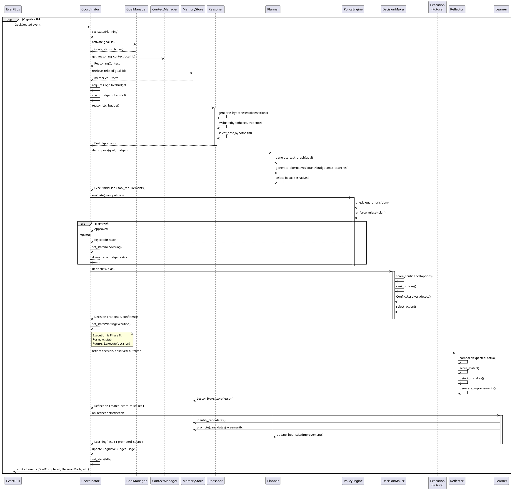
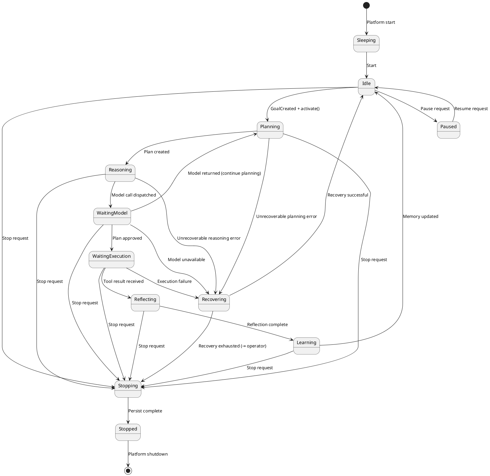
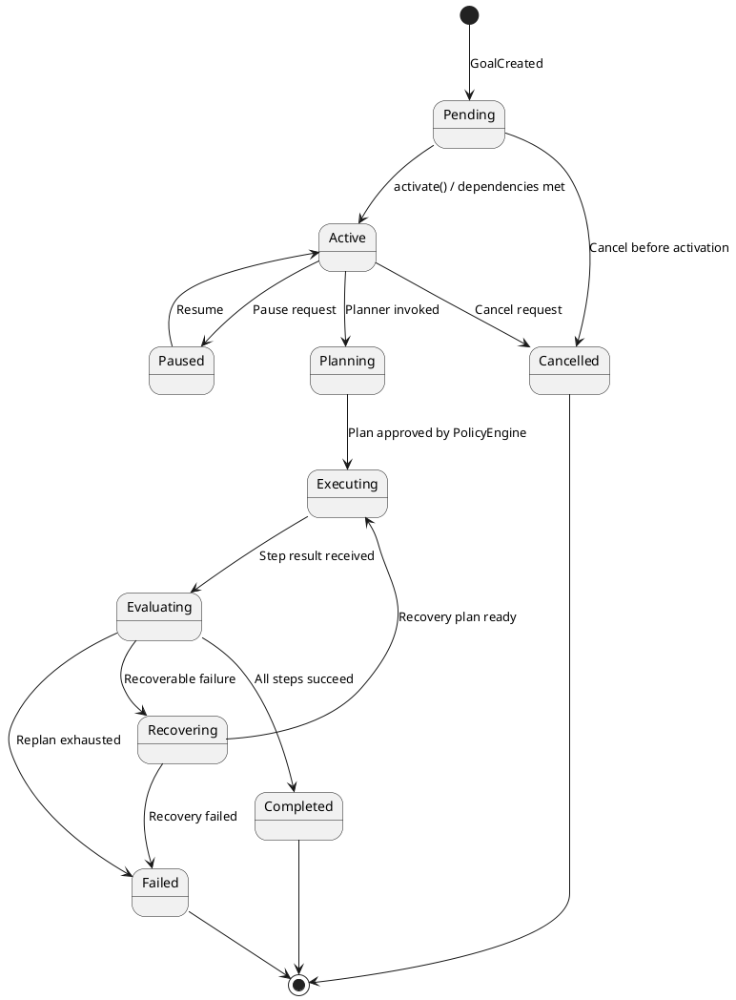
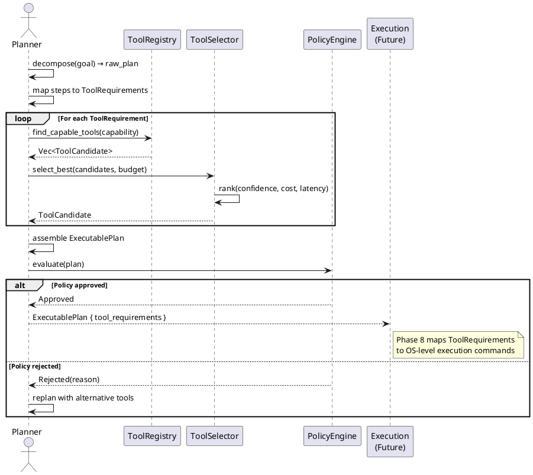

# Cognitive Loop

The Brain Platform's primary control flow — the structured cycle that transforms goals into decisions, actions, and learning.

---

## 1. Brain Lifecycle

```
┌─────────────────────────────────────────────────────┐
│ BrainPlatform │
│ │
Init ─────│────► bootstrap subsystems
Start ────│────► restore state, subscribe, begin loop
Tick ─────│────► cognitive_loop.tick() [per goal or event]
Stop ─────│────► persist state, unsubscribe, shutdown
└─────────────────────────────────────────────────────┘
```

### Lifecycle States

| State | Description |
|---|---|
| `Sleeping` | Platform started but no goals pending. Awaiting input. |
| `Idle` | Ready. No active goal. Loop running, polling for work. |
| `Running` | At least one goal is active. Loop executing. |
| `Paused` | Loop suspended. No new goals processed. Existing goals wait. |
| `Stopping` | Shutdown sequence in progress. Persisting, unsubscribing. |
| `Stopped` | Fully halted. No in-flight work. |
| `Failed` | Unrecoverable error. Persisted for operator review. |

### State Transitions

```text
Sleeping ──► Idle (on Start)
Idle ──► Running (on GoalCreated)
Running ──► Paused (on pause request)
Paused ──► Running (on resume)
Running ──► Stopping (on Stop)
Stopping ──► Stopped (on persist complete)
Any ──► Failed (on unrecoverable error)
Failed ──► Idle (on operator reset)
```

---

## 2. Cognitive State Machine

### BrainState Enum

**States (unit variants — no data):**

| State | Meaning |
|---|---|
| `Sleeping` | Platform started, no goals in flight. Awaiting input. |
| `Idle` | Ready for work. Polling event bus and goal queue. |
| `Planning` | Currently decomposing goals into plans. |
| `Reasoning` | Invoking model for chain-of-thought reasoning. |
| `WaitingModel` | Awaiting model completion (async I/O, no local CPU work). |
| `WaitingExecution` | Awaiting Execution Platform to complete a dispatched tool call. |
| `Reflecting` | Comparing actual outcomes to expected outcomes. |
| `Learning` | Consolidating lessons and promoting memory. |
| `Recovering` | Recovering from a failure in the cognitive loop. |
| `Paused` | Loop suspended by operator or policy. |
| `Stopped` | Fully halted. |

### State Ownership

`Coordinator` owns the current `BrainState`. Transitions are guarded:

```text
Coordinator::set_state(new_state) ──► validate_transition(current, new) ──► RwLock.write()
```

### Valid Transitions

| From | To | Trigger |
|---|---|---|
| `Sleeping` | `Idle` | `Start` invoked |
| `Idle` | `Planning` | Active goal available |
| `Planning` | `Reasoning` | Plan created, invoke model |
| `Reasoning` | `WaitingModel` | Model call dispatched |
| `WaitingModel` | `Planning` | Model returned, continue loop |
| `WaitingModel` | `WaitingExecution` | Plan selected, dispatch tool |
| `WaitingExecution` | `Reflecting` | Tool result received |
| `Reflecting` | `Learning` | Reflection complete |
| `Learning` | `Idle` | Memory updated |
| `*` | `Recovering` | Unrecoverable error |
| `Recovering` | `Idle` | Recovery plan executed |
| `*` | `Paused` | Pause request |
| `Paused` | `Idle` | Resume request |
| `*` | `Stopping` | `Stop` invoked |
| `Stopping` | `Stopped` | Persist complete |

---

## 3. Cognitive Loop

The primary loop. Drives all cognitive activity for one active goal.

```
┌──────────────────────────┐
│ Coordinator │
│ │
GoalCreated event ──►│ 1. Retrieve Goal
│ 2. Acquire CognitiveBudget
│ 3. Set State: Planning
└───────────┬────────────────┘
│ goal_context
▼
┌──────────────────────────┐
│ GoalManager │
│ │
│ activate(goal_id)
│ validate_dependencies()
│ set status: Active
└───────────┬────────────────┘
│
▼
┌──────────────────────────┐
│ ContextManager │
│ │
│ get_reasoning_context()
│ get_decision_context()
│ get_planning_context()
└───────────┬────────────────┘
│ ReasoningContext
▼
┌────────────────────────�──────────┐
│ MemoryPlatform │
│ │
│ retrieve_related(goal_id)
│ retrieve_context()
└───────────┬────────────────┘
│ memories + facts
▼
┌──────────────────────────┐
│ Reasoner │
│ │
│ reason(ctx)  ──► [Model Call ──► LLM/Model]
│ generate_hypotheses()
│ infer()
│ select_best_hypothesis()
└───────────┬────────────────┘
│ selected approach
▼
┌──────────────────────────┐
│ Planner │
│ │
│ decompose(goal, budget)
│ generate_task_graph()
│ resolve_dependencies()
│ generate_alternatives()
│ select_best()
│ [returns abstract ToolRequirements, not OS commands]
└───────────┬────────────────┘
│ Plan + ToolRequirements
▼
┌──────────────────────────┐
│ PolicyEngine │
│ (brain-policy crate) │
│ │
│ evaluate(plan)
│ check_guard_rails()
│ enforce_ruleset()
└───────────┬────────────────┘
│ approved / rejected
▼ (if rejected ──► Recovery)
┌──────────────────────────┐
│ DecisionMaker │
│ │
│ decide(ctx)
│ score_confidence()
│ select_action()
│ [returns Decision + Explanation]
└───────────┬────────────────┘
│ Decision
▼
┌──────────────────────────┐
│ Future: Execution │
│ Platform (Phase 8) │
│ [NOT yet implemented] │
└───────────▲────────────────┘
│ Execution result
▼
┌──────────────────────────┐
│ Observer │
│ [Phase 9 / Perception] │
│ captures actual outcome │
└───────────▲────────────────┘
│ ObservedOutcome
▼
┌──────────────────────────┐
│ Reflector │
│ │
│ reflect(decision, outcome)
│ compare() [expected vs actual]
│ detect_mistakes()
└───────────▲────────────────┘
│ Reflection
▼
┌──────────────────────────┐
│ Learner │
│ │
│ on_reflection()
│ identify_candidates()
│ promote_if_needed() ──► MemoryPlatform
│ update_heuristics() ──► Planner
└───────────▲────────────────┘
│
▼
┌──────────────────────────┐
│ MemoryPlatform │
│ promotes episodic ──► semantic
│ records lessons learned
│ updates confidence scores
└───────────▲────────────────┘
│
└─────────────────────────► (back to top for next goal)
```

---

## 4. CognitiveBudget

Every reasoning cycle receives a `CognitiveBudget` before entering the loop. The budget is checked at each phase boundary. Exhaustion of any budget dimension triggers graceful degradation or pause.

### Fields

| Field | Type | Description |
|---|---|---|
| `max_thinking_time_ns` | `u64` | Maximum wall-clock time for the entire cycle (nanoseconds) |
| `max_iterations` | `usize` | Maximum loop iterations for this goal |
| `max_reasoning_depth` | `usize` | Maximum depth of reasoning: steps in chain-of-thought |
| `max_branches` | `usize` | Maximum parallel branches in reasoning |
| `max_model_calls` | `usize` | Maximum model invocations per cycle |
| `max_token_budget` | `u32` | Maximum tokens to consume across all model calls |
| `max_cost_budget_cents` | `u64` | Maximum cost (USD cents) for this cycle |
| `deadline` | `CognitiveTimestamp` | Absolute deadline. Cycle must complete before this timestamp. |
| `priority` | `u8` | Relative priority (higher = more resources) |

### BudgetChecker Contract

| Method | Input | Output | Meaning |
|---|---|---|---|
| `exhausted(usage)` | `BudgetUsage` | `bool` | Any resource at or past its limit |
| `remaining_tokens(usage)` | `BudgetUsage` | `u32` | Tokens left before cap |
| `remaining_cost_cents(usage)` | `BudgetUsage` | `u64` | Budget cents left |
| `past_deadline(now)` | `CognitiveTimestamp` | `bool` | Current time past deadline |
| `degraded()` | — | `CognitiveBudget` | Returns a reduced-scope copy for retry |

### BudgetUsage (Consumed Dimensions)

| Field | Type | Consumed By |
|---|---|---|
| `iterations_used` | `usize` | Coordinator loop counter |
| `reasoning_depth_reached` | `usize` | Reasoner |
| `branches_spawned` | `usize` | Planner |
| `model_calls_used` | `usize` | Reasoner, Planner |
| `tokens_consumed` | `u32` | Reasoner, Planner |
| `cost_incurred_cents` | `u64` | Model calls (via ModelProvider) |
| `started_at` | `CognitiveTimestamp` | Coordinator |
| `last_checkpoint` | `CognitiveTimestamp` | Coordinator |

### Budget Enforcement Points

| Phase | Checked | On Exhaustion |
|---|---|---|
| `Planning` | Iterations, token budget | Degrade: fewer alternatives generated |
| `Reasoning` | Max reasoning depth, max model calls | Pause, emit `BudgetExhausted` event |
| `Decision` | Always passes budget check (cheap) | — |
| `Tool Planning` | Max branches | Prune lowest-value branches |
| `Reflection` | Iterations | Write partial reflection, emit warning |
| `Learning` | Cost budget | Defer to next cycle |

### Budget Consumption by Subsystem

| Subsystem | Consumes | Updates via |
|---|---|---|
| `Planner` | iterations, token_budget | `BudgetUsage::iterations_used` |
| `Reasoner` | reasoning_depth, model_calls, tokens, cost | `BudgetUsage::reasoning_depth_reached`, `model_calls_used`, `tokens_consumed` |
| `DecisionMaker` | (minimal — < 500 µs) | none |
| `Coordinator` | deadline check, iteration loop | `BudgetUsage::iterations_used` |

---

## 5. Tool Planning (Abstract)

Execution Platform (Phase 8) is not yet implemented. The Brain's Planner must express intent in abstract *tool requirements*, not OS-level commands.

### ToolRequirement Contract

A `ToolRequirement` declares **what capability is needed**, not **which tool executes it**.

| Field | Purpose |
|---|---|
| `capability: ToolCapabilityId` | What the tool must be able to do (e.g., `"read_file"`, `"run_command"`, `"search_web"`) |
| `inputs: HashMap<String, ToolValue>` | Abstract input values |
| `expected_outputs: Vec<String>` | Named outputs the planner expects back |
| `timeout_ms: Option<u64>` | Soft timeout hint |
| `retry_policy: RetryPolicy` | How many retries on transient failure |
| `priority: u8` | Higher = must-have |

### ToolCandidate Contract

A `ToolCandidate` satisfies a `ToolRequirement`:

| Field | Purpose |
|---|---|
| `provider: String` | `"execution"`, `"perception"`, `"custom:foo"` |
| `capability: ToolCapabilityId` | Matches requirement |
| `estimated_cost: f64` | Cost estimate (USD) |
| `estimated_duration_ms: u64` | Latency estimate |
| `confidence: Confidence` | How well this tool matches |
| `side_effects: Vec<SideEffect>` | Declared side effects |

### SideEffect Values

| Variant | Meaning |
|---|---|
| `FilesystemWrite(path)` | Will create or modify a file |
| `NetworkRequest(host)` | Will make an outbound network call |
| `ProcessSpawn` | Will spawn a new OS process |
| `StateMutation(description)` | Will mutate platform or agent state |
| `NoSideEffects` | Read-only; safe to retry |

### Tool Selection Flow

```
Planner produces: ToolRequirements
│
▼
┌───────────────────────┐
│ ToolSelector          │
│ (in brain-planner)    │
│                       │
│ match(requirement) ──► queries ToolRegistry
│ rank(candidates) ──► by confidence, cost, latency
│ select_best() ──► returns ToolCandidate
└───────────▲───────────┘
│ ToolCandidate
▼
┌───────────────────────┐
│ DecisionMaker         │
│ validates side_effects│
│ checks policies       │
│ [in brain-policy]     │
└───────────▲───────────┘
│ Approved ToolCandidate
▼
[Future: Execution Platform maps ToolCandidate → actual dispatch]
```

---

## 6. BrainState in the Cognitive Loop

State transitions within a single tick:

```text
tick() starts
│
▼
BrainState::Idle
│ goal available
▼
BrainState::Planning
│ plan created
▼
BrainState::Reasoning
│ model call issued
▼
BrainState::WaitingModel
│ model response received
▼
BrainState::Planning (tool selection)
│ tool candidates selected
▼
BrainState::WaitingExecution
│ Execution result received (Phase 8; stub for now)
▼
BrainState::Reflecting
│ reflection complete
▼
BrainState::Learning
│ memory updated, lessons stored
▼
┌───────────┐
│ Back to   │
│ Planning  │──── next goal or same goal continues
└───────────┘
```

---

## 7. Goal Lifecycle

```
Pending
│ (GoalManager::activate)
▼
Active
│ (Planner begins)
▼
Planning ──► Paused (operator pause)
│ (Plan created)
▼
Executing ──► WaitingExecution ──► WaitingModel
│ (step outcome observed)
▼
Evaluating
│ (on failure)
├──► Recovering ──► Executing (replan)
│
│ (on success)
▼
Completed or Failed or Cancelled
```

**Transition table:**

| Transition | Allowed | Condition |
|---|---|---|
| `Pending → Active` | yes | Dependencies satisfied |
| `Active → Planning` | yes | Planner invoked |
| `Planning → Executing` | yes | Plan approved by PolicyEngine |
| `Executing → Evaluating` | yes | Step completed |
| `Evaluating → Completed` | yes | All steps succeed |
| `Evaluating → Failed` | yes | Replan exhausted |
| `Evaluating → Recovering` | yes | Recoverable error |
| `Recovering → Executing` | yes | Recovery plan ready |
| `Recovering → Failed` | yes | Recovery exhausted |
| `* → Paused` | yes | Operator pause request |
| `* → Cancelled` | yes | Operator cancel request |
| `* → Failed` | no | Only from Evaluating or Recovering |

---

## 8. Planner Flow

```
Planner::decompose(goal, budget)
│
▼
Acquire write lock on goal (brief)
Call model: generate_task_graph(goal, context)
▼
TaskGraph { nodes, edges, entry_points }
│
▼
TaskGraphBuilder::resolve_dependencies(graph)
│ - topological sort
│ - detect cycles → return error
│ - mark parallelizable groups
▼
TaskGraphBuilder::validate(graph)
│ - no cycles
│ - all entry points reachable
│ - budget sufficient for all steps
▼
Select planning strategy (from budget.priority)
│ priority >= 3 → MeansEndsAnalysis (highest quality)
│ priority >= 2 → ForwardChaining
│ priority >= 1 → BackwardChaining
│ else → TemplateMatch (cheapest)
▼
For each strategy (up to budget.max_branches):
  generate AlternativePlan
  estimate_cost(alt)
  estimate_duration(alt)
  estimate_confidence(alt)
▼
Planner::select_best(alternatives, criteria)
criteria = SelectionCriteria { minimize_cost, minimize_duration, maximize_confidence }
▼
Best AlternativePlan
│
▼
Convert PlanStep actions to ToolRequirements
[No OS commands — abstract tool calls only]
│
▼
Return ExecutablePlan
```

### Plan Optimization (within budget)

`PlanOptimizer::optimize` is called if `budget.max_iterations > 0`:

1. **Prune**: Remove steps not on the critical path.
2. **Merge**: Combine sequential independent steps into a single batch if the tool supports it.
3. **Reorder**: Execute independent parallel groups concurrently.
4. **Validate**: Re-check budget after optimization. If over budget, downgrade and re-optimize.

---

## 9. Reasoning Flow

```
Reasoner::reason(ctx, budget)
│
▼
emit ReasoningStarted event
│
▼
For depth in 1..budget.max_reasoning_depth:
│
▼
Call model: generate_chain_of_thought(ctx, budget)
[consumes: model_call, tokens, cost]
│
▼
Hypotheses generated:
  for each hypothesis:
    evaluate(hypothesis, evidence)
    [confidence scoring]
    filter out confidence < threshold
│
▼
If single high-confidence hypothesis:
  select_best_hypothesis() → return
Else if multiple candidates AND budget.max_branches > remaining_branches:
  select top-N by confidence → continue depth++
Else:
  select best available → return
▼
Budget exhausted:
  emit BudgetExhausted event
  return best hypothesis found so far (may be low-confidence)
▼
emit ReasoningFinished event
```

---

## 10. Decision Flow

```
DecisionMaker::decide(ctx, budget)
│
▼
PolicyEngine::evaluate(plan, policies)
│ check guard rails
│ apply RuleSet
▼
If rejected by policy:
  emit DecisionRejected event
  return error with rejection reason
▼
Evaluate candidates using SelectionCriteria:
                ┌──────────────────────────────────────┐
                │ ConfidenceScorer                     │
                │ aggregates evidence, context, model  │
                └──────────────────────────────────────┘
│
▼
Rank options:
  primary sort: confidence (descending)
  secondary sort: cost (ascending)
  tertiary sort: risk (ascending)
▼
Select top option
│
▼
Check for conflicts:
  ConflictResolver::detect(options)
  If conflict:
    resolve(conflict, options)
    If critical: emit EscalationRequired event
▼
Build Decision:
  decision = Decision {
    selected_option,
    alternatives_considered,
    rationale,
    confidence,
    timestamp,
  }
▼
ExplanationGenerator::explain(decision)
[human-readable explanation stored in Decision.explanation]
▼
emit DecisionMade event
return Decision
```

---

## 11. Reflection Flow

```
Reflector::reflect(decision, actual_outcome)
│
▼
OutcomeComparison {
  expected: decision.selected_option.expected_outcome,
  actual: actual_outcome,
}
│
▼
score_match(comparison) → match_score [0.0..1.0]
│
▼
If match_score < REFLECTION_THRESHOLD (0.8):
  generate deviations:
    for each measurable dimension:
      compare expected vs actual
      classify severity: Negligible | Minor | Major | Critical
▼
MistakeDetector::detect(reflection)
→ Vec<Mistake>
▼
For each mistake:
  classify(mistake) → MistakeType
  severity(mistake) → DeviationSeverity
▼
ImprovementGenerator::generate(reflection, mistakes)
→ Vec<Improvement>
▼
Prioritize improvements by:
  estimated_benefit × confidence
  target process criticality
▼
LessonLearned {
  lesson_type: Success | Mistake | NearMiss | UnexpectedOutcome,
  description,
  applicable_contexts: [goal_type, domain, ...],
  confidence,
}
▼
LessonStore::store(lesson)
→ persisted to MemoryPlatform (semantic tier)
▼
emit ReflectionCompleted event
return Reflection
```

---

## 12. Learning Flow

```
Learner::run_cycle()
│
▼
Check for pending triggers:
  - Goal completed
  - Mistake detected
  - Periodic timer (configurable)
  - Performance degraded
▼
On trigger:
  Request: LearningRequest { source, trigger, scope }
▼
1. Identify candidates:
  MemoryPromoter::identify_candidates(scope)
  → Vec<EpisodicMemoryRef>
▼
2. Filter by should_promote():
  criteria: access_count, importance, recency, pattern recurrence
▼
3. Consolidate:
  MemoryPromoter::consolidate(candidates)
  → Vec<SemanticFact> [written to MemoryPlatform]
▼
4. Feed back to planner:
  PlanningImprover::adjust_planner(lessons)
  → PlanningAdjustments { strategy_bias, step_ordering_hints }
▼
5. Feed back to reasoner:
  PlanningImprover::update_heuristics(improvements)
  → updated heuristic weights in Reasoner config
▼
6. emit LearningCompleted event
   { source, promoted_count, adjustments_made }
```

---

## 13. Multi-Goal Scheduling

### Concurrent Goal Execution

```
Coordinator
│
├── goal_queue: PriorityQueue<Goal> (ordered by priority)
│
├── active_goals: HashMap<GoalId, GoalState>
│   max_active = configurable (default: 3)
│
└── cognitive_budget_pool: shared budget allocation
```

**Scheduling policy:**

1. **Priority preemption**: A `Critical` goal can pause a `Low` goal.
2. **Fair round-robin**: Within the same priority level, goals rotate in order.
3. **Budget fair-share**: Total token/cost budget is divided equally among active goals.
4. **Deadline awareness**: Goals approaching deadline are promoted in priority.
5. **Dependency blocking**: A goal whose dependencies are incomplete stays in `Pending`.

### GoalScheduleDecision Contract

| Field | Type | Description |
|---|---|---|
| `goal_id` | `GoalId` | Goal being scheduled |
| `action` | `ScheduleAction` | `Start` / `Preempt(other_goal)` / `Wait` / `Blocked` |
| `reason` | `string` | Why this decision |
| `allocated_budget` | `CognitiveBudget` | Budget granted for this scheduling slice |

---

## 14. Retry Strategy

### Cognitive Loop Retries

| Failure Point | Retry Strategy | Max Attempts |
|---|---|---|
| Model call (Reasoner) | Re-issue with same prompt; then degrade depth | 2 |
| Planning | Fall back to simpler strategy | 3 (MEA → FC → BC → Template) |
| Tool execution wait | Wait per timeout; then timeout and reflect | 1 |
| Policy evaluation | Log rejection; request human review if critical | 0 |
| Reflection/matching | Skip comparison; emit low-confidence warning | 1 |
| Memory promotion | Retry on transient storage error | 3 |
| Budget exhaustion | Degrade budget; re-run current phase | 1 |

### Exponential Backoff for Model Calls

| Field | Type | Meaning |
|---|---|---|
| `max_attempts` | `u32` | Total retries (including original call) |
| `initial_delay_ms` | `u64` | First retry delay |
| `max_delay_ms` | `u64` | Cap on backoff growth |
| `backoff_multiplier` | `f64` | Multiplier applied after each failure |
| `retryable_errors` | List | `Timeout`, `RateLimitExceeded`, `ServiceUnavailable`, `InternalServerError` |

**Non-retryable errors:** `InvalidRequest` (programmer error), `ContentFilter` (policy violation), `Authentication` (config error).

---

## 15. Failure Recovery

### Recovery Plan

```
Failure detected (any phase)
│
▼
Record failure in CognitiveState.failures log
│
▼
Determine failure type:
│
├── Transient (network, rate limit, timeout)
│   └──► Retry with backoff
│
├── Planning failure
│   └──► Select alternative strategy (up to 3 attempts)
│   └──► If all fail: mark Goal Failed, emit GoalFailed event
│
├── Policy rejection
│   └──► Escalate to human if critical
│   └──► Otherwise: update plan to satisfy policy
│
├── Budget exhaustion
│   └──► Degrade budget (reduce branches, depth)
│   └──► Continue with reduced scope
│   └──► If still exhausted: emit BoundedResult event
│
├── Model unavailable
│   └──► Use cached/default reasoning (no LLM)
│   └──► Emit DegradedMode event
│
└── Storage failure (Memory/Runtime)
    └──► Pause CognitiveLoop
    └──► Retry storage with backoff
    └──► If persistent: transition to Recovering state
```

### Recovery State Behavior

In `BrainState::Recovering`:

- The Coordinator does not process new goals.
- A recovery task runs on the Tokio runtime.
- If recovery succeeds: state → `Idle`, resume queue.
- If recovery fails after N attempts: state → `Stopped`, emit `BrainFailed` event for operator intervention.

---

## 16. Human Interruption

### Pause / Resume

**Pause request — cooperative (phase boundaries only, never during a model call):**

```text
Coordinator::pause()
→ set state: Paused
→ emit BrainPaused event
→ [in-flight Execution tasks are preserved but not polled]
```

**Resume:**

```text
Coordinator::resume()
→ set state: Idle (or previous state)
→ emit BrainResumed event
→ resume polling from where we left off
```

### Cancel Goal

```text
GoalManager::cancel(goal_id, reason)
→ set goal state: Cancelled
→ emit GoalCancelled event
→ if goal is active in cognitive loop:
→ interrupt current tick
→ emit LoopInterrupted event
→ return to Idle
```

### Override Decision

```text
Coordinator::override_decision(decision_id, override_action)
→ emit DecisionOverridden event
→ Record override in DecisionExplanation
→ Continue with override_action as the selected option
```

---

## 17. Sequence Diagram — Full Cognitive Loop



---

## 18. PlantUML — Cognitive State Machine



---

## 19. PlantUML — Goal Lifecycle



---

## 20. PlantUML — Tool Planning Flow



---

## Cross-References

- [`docs/architecture/brain.md`](brain.md) — overall crate structure and responsibilities
- [`docs/interfaces/brain-events.md`](brain-events.md) — canonical event catalog
- [`docs/architecture/brain-dependencies.md`](brain-dependencies.md) — inter-crate dependency matrix
- [`docs/configuration/brain.md`](configuration/brain.md) — full `brain.toml` reference
- [`docs/rfc/RFC-0003-brain-platform.md`](../rfc/RFC-0003-brain-platform.md) — approved design rationale
